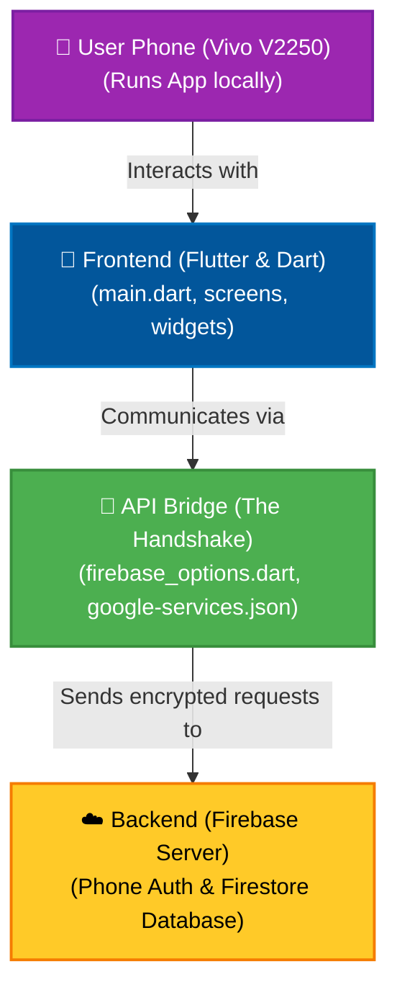
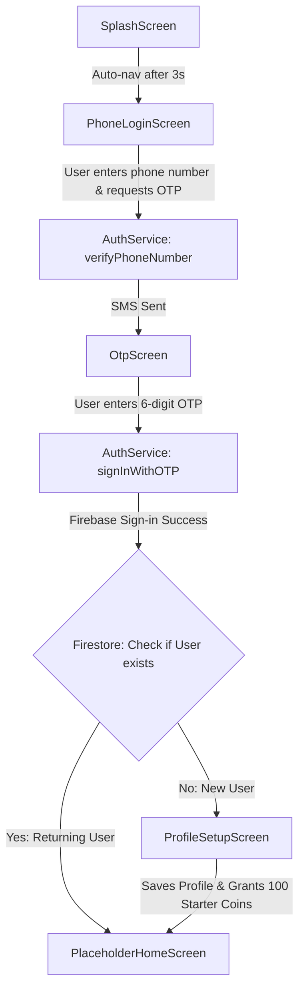
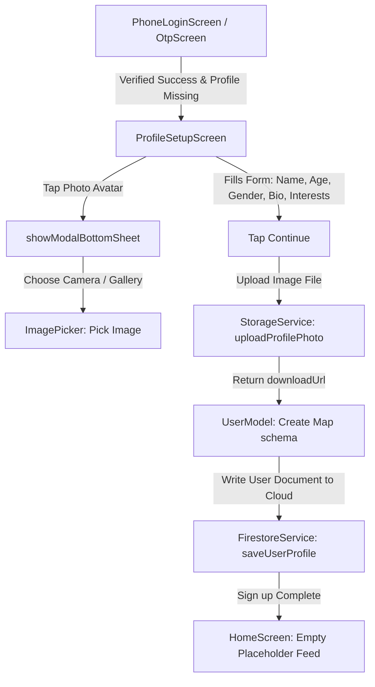
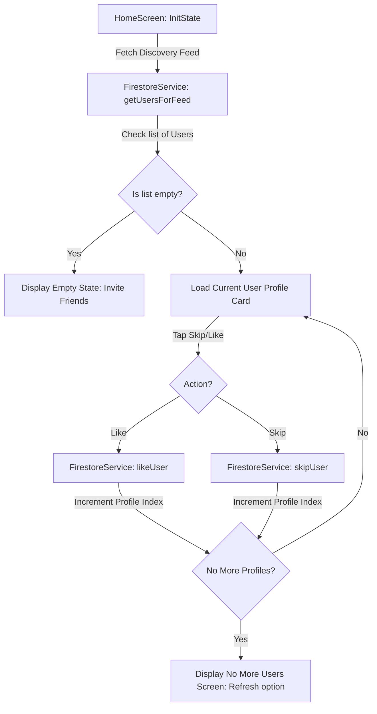
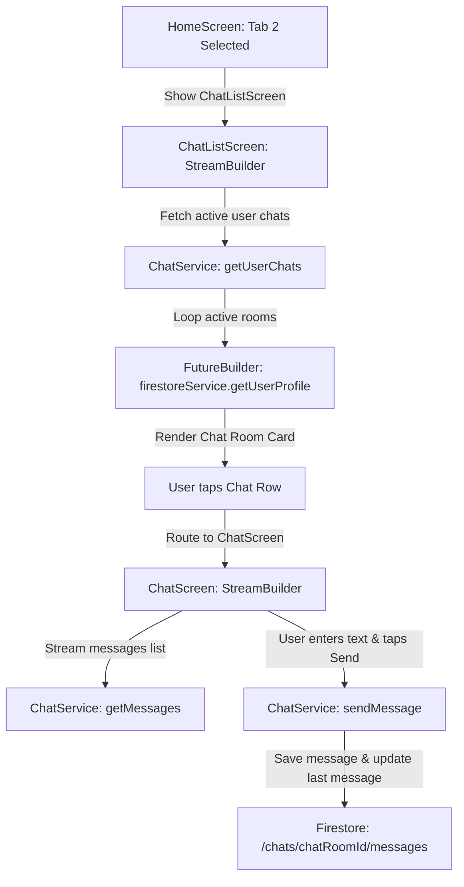

# 📱 FRND - Ultimate Flutter Dating App Workspace

Welcome to **`frnd_app`**, the architectural codebase for your production-grade, highly scalable mobile dating application. 

> [!NOTE]  
> **Hey Developer!** This document is an exhaustive, beginner-friendly manual designed specifically for freshers. It explains the **Tech Stack**, a **Step-by-Step Installation History**, and a **Conceptual Glossary** of everything we set up today.

---

## 🗺️ System Architecture at a Glance

To see how all the pieces we configured today connect, look at this simple visual map:



---

## 🛠️ Section 1: Tech Stack with Definitions

Every technology we utilized today has a specific purpose. Below is a detailed catalog explaining **what** each tool is, its **category**, **why** we chose it, and **which files** it affects in the project.

| Technology | Category | Definition | Why We Chose It | Affected Files in Project |
| :--- | :--- | :--- | :--- | :--- |
| **Flutter** | 🎨 Frontend | Google's UI software development kit (SDK) used to paint pixels directly on the screen. | To write one codebase that compiles into beautiful native apps for both Android and iOS. | `lib/main.dart`, entire `lib/` and `android/` folders. |
| **Dart** | 🧠 Language | A client-optimized, object-oriented programming language created by Google. | It is the "brain" and logic language used to make Flutter widgets interactive. | Every `.dart` file inside the `lib/` directory. |
| **Firebase Core** | ☁️ Backend | The foundation package required to initialize any Firebase service in a Flutter app. | It acts as the gateway to connect our local code with Google's cloud server. | `pubspec.yaml`, `lib/main.dart`. |
| **Firebase Auth (Phone OTP)** | ☁️ Backend | A secure user authentication service that handles logins via SMS verification codes. | Standard for Indian apps; verifies a user is a real person and prevents spam/fake accounts. | `pubspec.yaml`, `lib/screens/auth/`. |
| **Cloud Firestore** | ☁️ Backend | Google's flexible, real-time NoSQL database that stores data as collections and documents. | Push-synchs messages, user profiles, and coins in real time in milliseconds without page refreshes. | `pubspec.yaml`, `lib/services/`. |
| **Firebase Storage** | ☁️ Backend | A cloud-hosted storage bucket designed for hosting heavy files like photos, videos, and audio. | Required to store and retrieve user profile photos and media uploads securely. | `pubspec.yaml`, `lib/screens/profile/`. |
| **Firebase Analytics** | ☁️ Backend | A free app measurement solution that tracks user behavior, actions, retention, and revenue. | Essential for business decisions to understand user habits, drop-offs, and conversions. | `pubspec.yaml`, `lib/main.dart`. |
| **Firebase Crashlytics** | 🛠️ DevTool | A real-time crash reporter that tells you exactly which line of code caused an app crash in the wild. | Helps developers find and fix bugs instantly before users leave bad reviews. | `pubspec.yaml`, `lib/main.dart`. |
| **FlutterFire CLI** | 🛠️ DevTool | A command-line utility used to link a local Flutter app to a Firebase cloud project. | Automates the entire complex cloud credential linking process in one command. | `lib/firebase_options.dart`, `android/app/google-services.json`. |
| **Firebase CLI** | 🛠️ DevTool | The official command-line tool to manage, deploy, and configure Firebase resources. | Required globally so developer tools (like FlutterFire) can query and authenticate GCP accounts. | Global user config files under `%USERPROFILE%\.config`. |
| **google_fonts** | 🎨 Frontend | A Flutter package providing easy access to thousands of custom Google Fonts. | Bypasses manual asset downloading; lets us use clean, modern typography like Inter or Outfit. | `pubspec.yaml`, `lib/constants/`. |
| **cached_network_image** | 🎨 Frontend | A library that downloads, caches, and displays web images with loading spinners. | Speeds up image loading and reduces mobile data usage by saving downloaded photos locally. | `pubspec.yaml`, `lib/widgets/`. |
| **flutter_svg** | 🎨 Frontend | A package used to render Scalable Vector Graphics (.svg) files in Flutter. | Keeps icons and logo vectors razor-sharp across all phone screen resolutions. | `pubspec.yaml`, `lib/widgets/`. |
| **go_router** | 🔌 Navigation | A declarative routing package for Flutter that manages screen transitions and deep links. | Standardizes page-to-page navigation, making it easy to pass data between screens. | `pubspec.yaml`, `lib/main.dart`. |
| **flutter_riverpod** | ⚡ Management | A robust, reactive state-management and dependency injection framework for Flutter. | The "central nervous system" that updates the UI automatically when data changes. | `pubspec.yaml`, `lib/main.dart`. |
| **image_picker** | 🛠️ DevTool | A Flutter plugin for selecting images from the phone's gallery or taking new photos with the camera. | Essential for dating apps so users can capture and upload their profile photos. | `pubspec.yaml`, `lib/screens/profile/`. |
| **shared_preferences** | 💾 Storage | A plugin that saves simple key-value data directly on the phone's hardware. | Used for quick local caching, like storing the user's login state or dark mode theme. | `pubspec.yaml`, `lib/utils/`. |
| **Node.js** | 🛠️ DevTool | An open-source, cross-platform JavaScript runtime environment. | Strictly required to run Node Package Manager (`npm`) to install developer tools. | Windows System files. |
| **VS Code** | 🛠️ DevTool | A high-performance, lightweight source code editor. | The industry-standard editor for writing, debugging, and running Flutter code. | `pubspec.yaml`, `.vscode/`. |
| **Android Studio** | 🛠️ DevTool | Google's official integrated development environment (IDE) for Android development. | Provides the core Android SDK tools, compilers, and emulators to build Android apps. | `C:\Users\YourName\AppData\Local\Android\Sdk`. |
| **Git** | 🛠️ DevTool | A distributed version-control system that tracks changes in source code during development. | Essential for backup, tracking code changes, and team collaboration. | `.git/` folder, `.gitignore`. |

---

## 🛠️ Section 2: Step-by-Step Setup Done Today

Here is the exact history of every single installation and configuration completed today, in chronological order:

### STEP 1 — Flutter SDK Installation
* **Downloaded**: Fetched the official Flutter ZIP archive from [flutter.dev](https://flutter.dev/docs/get-started/install/windows).
* **Extracted**: Extracted the package directly to `E:\flutter`.
  > [!TIP]
  > We chose the `E:` drive because it is our primary working drive. This keeps your primary `C:` drive completely clean and saves valuable hard disk space.
* **Environment variable setup**: Appended the executable directory `E:\flutter\bin` to the Windows System **`Path`** variable.
  * **How we did it**: Click **Windows key** → search and select **"Edit the system environment variables"** → Click the **"Environment Variables"** button → Under **"User Variables"** or **"System Variables"**, find **`Path`** → click **Edit** → click **New** → paste **`E:\flutter\bin`** → Click **OK** → **OK** → **OK**.
* **Verification**: Opened a fresh terminal and ran:
  ```cmd
  flutter doctor
  ```

### STEP 2 — Android Studio Installation
* **Downloaded**: Got the installer from [developer.android.com/studio](https://developer.android.com/studio).
* **SDK Tools Config**: Opened Android Studio, navigated to **SDK Manager** → **SDK Tools** tab, and explicitly checked:
  * ✅ **Android SDK Command-line Tools (latest)**
  * ✅ **Android SDK Build-Tools**
  * Clicked **Apply** → **OK** to download them.
* **Licenses Accepted**: Opened a terminal and ran:
  ```cmd
  flutter doctor --android-licenses
  ```
  * *Action*: Pressed **`y`** followed by **Enter** for every prompt to accept all of Google's developer terms.

### STEP 3 — VS Code Installation
* **Downloaded**: Got the editor from [code.visualstudio.com](https://code.visualstudio.com).
* **Extensions**: Clicked the Extensions icon (`Ctrl+Shift+X`), searched, and installed:
  * 📦 **Flutter** (by Dart Code)
  * 📦 **Dart** (by Dart Code)
* **Command explanation**: Running **`code .`** in your command terminal means:
  * `"code"` = Launch Visual Studio Code.
  * `"."` = Open the current folder you are standing in.
  * *Result*: Instantly opens the entire project workspace directly inside VS Code.

### STEP 4 — Node.js Installation
* **Downloaded**: Fetched the LTS (Long Term Support) installer from [nodejs.org](https://nodejs.org).
* **Purpose**: Node.js comes bundled with `npm` (Node Package Manager), which is strictly required to download and install the global Firebase tools command.

### STEP 5 — Firebase CLI Installation
* **Command run**: Installed the CLI globally using the Node Package Manager:
  ```cmd
  npm install -g firebase-tools
  ```
* **Authentication**: Ran the login command to authenticate the CLI with Google Cloud:
  ```cmd
  firebase login
  ```
  * *Action*: This automatically opened your default web browser. We logged into your Google Account (`kotek6276@gmail.com`) and clicked **Allow** to authorize.

### STEP 6 — FlutterFire CLI Installation
* **Command run**: Activated the FlutterFire developer tools globally:
  ```cmd
  dart pub global activate flutterfire_cli
  ```
* **PATH Configuration**: Appended the global Pub binary directory to the Windows registry `Path`:
  * **`C:\Users\Dell\AppData\Local\Pub\Cache\bin`**
* **Why this is on the `C:` drive**: Even though the Flutter SDK is on the `E:` drive, Dart's global package cache is strictly managed by the Windows operating system and is always tied to your Windows User profile folder (`C:\Users\YourName`), not the Flutter installation folder.
* **How to find your Windows username**: Open a Command Prompt and type:
  ```cmd
  echo %USERNAME%
  ```

### STEP 7 — Flutter Project Created
* **Navigated**: Switched drives in CMD by typing:
  ```cmd
  e:
  cd E:\frnd
  ```
* **Created Project**: Ran the creation command:
  ```cmd
  flutter create frnd_app
  ```
* **Opened Editor**: Opened the new code directory directly in VS Code:
  ```cmd
  cd frnd_app
  code .
  ```

### STEP 8 — Firebase Project Created
* **Console**: Opened [console.firebase.google.com](https://console.firebase.google.com).
* **Created**: Added a new project named **`frnd-app`** (assigned Project ID: **`frnd-app-8c401`**).
* **Google Analytics**: **ENABLED**.
  * *Reason*: Tracks user actions, daily/monthly active users, user retention, revenue, and app crashes—completely for free.
* **Region Selected**: **`asia-south1` (Mumbai)**.
  > [!IMPORTANT]  
  > **Why Mumbai Region?**
  > * **Closest Server**: It is the closest geographical server to India.
  > * **Fast Speed**: Ensures extremely low latency and fast database loading speeds for Indian users.
  > * **Data Sovereignty**: Keeps user data stored inside India's borders (important for privacy laws).
  > * **Lower costs**: Saves network egress transit fees.
  > * **⚠️ CRITICAL**: The cloud storage region **CANNOT be changed after creation**. It must be picked correctly the first time.

### STEP 9 — Firebase Services Enabled

#### ① Authentication
* **Method Enabled**: **Phone (OTP)**.
* **Why**: Prevents spam, fake profiles, and automated bots. It is the standard for Indian dating and social apps to ensure real phone numbers are linked to accounts.

#### ② Firestore Database
* **Mode**: **Test Mode** (temporarily opens database read/write permissions for the first 30 days so we can easily test the app without complex rules).
* **Region**: **`asia-south1` (Mumbai)**.
* **Stored Data**: User profiles, matching records, messages, and coin wallet transactions.

#### ③ Firebase Storage
* **Mode**: **Test Mode**.
* **Stored Data**: Heavy media, including profile photos, chat image attachments, and voice notes.

### STEP 10 — FlutterFire Configure
* **Executed**: Ran the configuration command from your project root `E:\frnd\frnd_app`:
  ```cmd
  flutterfire configure --project=frnd-app-8c401 --yes
  ```
* **Output**: Automatically generated **`lib/firebase_options.dart`** and placed the Android native file **`android/app/google-services.json`**.
* **What it does**: Injects all the unique API keys and secret cloud database URLs into your Dart code, creating the digital handshake connecting your Flutter app to Firebase.

### STEP 11 — Packages Added to `pubspec.yaml`
* **Updated**: Opened `pubspec.yaml` and added these packages under the `dependencies:` section:
  ```yaml
  dependencies:
    flutter:
      sdk: flutter
    firebase_core: ^3.1.0
    firebase_auth: ^5.1.0
    cloud_firestore: ^5.1.0
    firebase_storage: ^12.1.0
    google_fonts: ^6.2.1
    cached_network_image: ^3.3.1
    flutter_svg: ^2.0.9
    go_router: ^14.1.4
    flutter_riverpod: ^2.5.1
    image_picker: ^1.1.2
    shared_preferences: ^2.2.3
  ```
* **Developer Settings**: Enabled **Windows Developer Mode** in your PC settings (required to allow the tools to create folder shortcuts called *symlinks* for these packages).
* **Command run**: Downloaded and linked the packages:
  ```cmd
  flutter pub get
  ```
  * *What it does*: Resolves the package tree, downloads them from Google's servers, and links them directly to your app.

### STEP 12 — Folder Structure Created
Created the professional architecture by running the following inside `E:\frnd\frnd_app\lib`:
```cmd
mkdir screens screens\auth screens\home screens\profile screens\chat screens\voice screens\wallet widgets models services utils constants
```

#### 📂 Final Folder Tree Structure
```text
lib/
├── constants/          # Holds global colors, themes, text styles, and dimensions.
├── models/             # Holds blueprints for data structures (e.g. User, Message schemas).
├── screens/            # Houses all separate pages of your application.
│   ├── auth/           # Login, Phone OTP verification screens.
│   ├── chat/           # Text chatting and match conversations.
│   ├── home/           # Swiping cards, matches, and discovery feed.
│   ├── profile/        # User profile, edit photo, settings.
│   ├── voice/          # Voice call and audio rooms screens.
│   └── wallet/         # Coin transactions, purchase, and wallet balances.
├── services/           # Backend database queries, Auth APIs, and Firebase logic.
├── utils/              # General helper methods, date formatters, and custom loggers.
├── widgets/            # Reusable visual components (buttons, input boxes, spinners).
├── firebase_options.dart # Generated Firebase config file containing API keys.
└── main.dart           # App entry point where execution begins.
```

### STEP 13 — App Tested
* **Connected phone**: Plugged your physical **Vivo V2250** Android phone into your PC via USB.
* **Enabled Developer Mode**: Opened your phone's **Settings** → **About Phone** → tapped **"Build Number"** 7 times until it unlocked.
* **Enabled USB Debugging**: Opened **Settings** → **Developer Options** → turned **USB Debugging** to **ON**. Changed USB Preferences in notifications to **File Transfer (MTP)** and tapped **Allow** on the phone prompt.
* **Checked Device**: Verified Flutter recognized your phone:
  ```cmd
  flutter devices
  ```
  * *Output*: `V2250 (mobile) • 10BDBY0QL3000NG • android-arm64 • Android 15 (API 35)`
* **Ran App**: Launched the app compilation:
  ```cmd
  flutter run
  ```
  * *Result*: The default counter app compiled, installed, and booted successfully on your Vivo phone!

---

## 📖 Section 3: Key Terms Explained

To help a fresher understand the core concepts we discussed today, here are simple explanations for our key developer terms:

> [!TIP]
> **Windows PATH Variable**: An internal Windows folder shortcut list. By adding a folder (like `E:\flutter\bin`) to the `Path` variable, we tell Windows: *"Always remember where this folder is."* This allows you to type its commands (like `flutter` or `firebase`) in *any* terminal window without typing the long folder location.

* **`code .` command**: A command run in your terminal. `code` opens your VS Code editor, and the dot `.` represents your current folder. It tells the PC to open the current workspace folder inside VS Code instantly.
* **`flutter pub get`**: The "Download" command for Dart/Flutter. It reads your `pubspec.yaml` list, connects to the internet, and downloads all the listed libraries to your computer.
* **`pubspec.yaml`**: The "Grocery List" of your Flutter project. It is a configuration file where you declare the app's name, version, assets (images/fonts), and list all the external packages your app needs to work.
* **`flutterfire configure`**: The "Digital Handshake" command. It queries your Google account, finds your Firebase projects, registers your Android/iOS apps, and generates **`lib/firebase_options.dart`** which holds the API keys needed to link your app to the cloud.
* **Test Mode (Firebase)**: A database setting that temporarily disables all read/write locks. It is strictly used during initial development so you can read and write data to Firestore instantly without having to write complex security rules.
* **`asia-south1` Region**: Google's geographical server location situated in **Mumbai, India**. This setting cannot be changed after creation because Google physicalizes your database hardware in that specific datacenter. Choosing Mumbai ensures lightning-fast speeds for Indian users.
* **USB Debugging**: A developer bridge toggle on Android. It allows your computer's compiler to communicate with your phone via USB to install, test, and debug apps directly on the screen.
* **Android Developer Mode**: A hidden developer menu in Android. Android hides it from normal users to prevent accidental system changes, but developers tap "Build Number" 7 times to unlock it so they can toggle USB Debugging.
* **Dart Pub Cache on `C:` Drive**: Dart stores downloaded package caches inside your Windows User profile folder (`C:\Users\YourName\AppData\Local\Pub\Cache`) because Windows holds user profile settings on the primary OS drive by default, independent of where you chose to install the Flutter SDK.

---

## 📱 Section 4: Day 3 — Phone Authentication, OTP Verification, & Firestore Profiling

In this phase, we moved from basic configuration to active feature development, building a secure user onboarding and authentication workflow linked directly to your Firebase project.



---

### 🛠️ Step-by-Step Feature Implementation & Troubleshooting

Below is the exact chronological history of what was implemented, resolved, and verified in your codebase today:

#### STEP 1 — Dependencies & Pubspec Check (Phase 3)
* **Action**: Opened `pubspec.yaml` and confirmed `firebase_auth: ^5.1.0` was present under dependencies. 
* **Action**: Executed `flutter pub get` in the terminal to fetch, resolve, and cache the package binaries.

#### STEP 2 — Global Authentication Service Created (Phase 4)
* **Created File**: [auth_service.dart](file:///E:/frnd/frnd_app/lib/services/auth_service.dart)
* **Purpose**: Encapsulated the entire authentication lifecycle inside a clean `AuthService` class, exposing methods for phone verification (`verifyPhoneNumber`), OTP sign-in (`signInWithOTP`), and sign-out handling.

#### STEP 3 — Phone Number Entry Screen Formed (Phase 5)
* **Created File**: [phone_login_screen.dart](file:///E:/frnd/frnd_app/lib/screens/auth/phone_login_screen.dart)
* **Design Features**: Beautiful custom HSL visual hierarchy with vibrant accent elements, country code styling (`🇮🇳 +91`), active validation handling, and a loader indicator while requesting OTPs.

#### STEP 4 — OTP Verification Screen Formed (Phase 6)
* **Created File**: [otp_screen.dart](file:///E:/frnd/frnd_app/lib/screens/auth/otp_screen.dart)
* **Design Features**: Custom 6-digit digit boxes that auto-focus adjacent boxes as you type and automatically queries Firestore `/users/{uid}` on successful sign-in.
  * **Routing Logic**: If the user's Firestore document exists, they are routed straight to the `PlaceholderHomeScreen` (returning user). If it does not exist, they are routed to `ProfileSetupScreen` (new user).

#### STEP 5 — User Profiling Screen Formed (Phase 7)
* **Created File**: [profile_setup_screen.dart](file:///E:/frnd/frnd_app/lib/screens/profile/profile_setup_screen.dart)
* **Design Features**: Modern input fields, gender selection ChoiceChips (Male, Female, Other), and an interactive calendar DatePicker.
* **Database Writing**:
  * On completion, it creates the user document under `/users/{uid}` in Firestore, capturing `uid`, `phoneNumber`, `name`, `gender`, `birthday` (ISO format), and `createdAt` timestamp.
  * **Starter Wallet Balance**: Credits the new user's document with **100 free coins** as a starting reward.
* **Home Screen Routing**: Connects directly to the custom **`PlaceholderHomeScreen`** and configures a safe logout action returning to the phone login screen.

#### STEP 6 — Compilation Debugging & Success (Phase 8)
* **Syntax Error Fix**: Corrected a layout bug in `profile_setup_screen.dart` where `MainAxisAlignment.between` was specified instead of the correct Flutter enum `MainAxisAlignment.spaceBetween`.
* **Path Resolution**: Fixed the Kotlin path computation compiler bug by adding `kotlin.incremental=false` to `android/gradle.properties` and running `flutter clean`, enabling seamless cross-drive compilation.
* **Build Verification**: Compiled the entire codebase successfully into an installable Android APK package (`√ Built build\app\outputs\flutter-apk\app-debug.apk`) in 89 seconds.

#### STEP 7 — Physical Device Connection & Launch
* **Troubleshot FuntouchOS Block**: Swapped to a data-capable USB-C cable and resolved the Vivo FuntouchOS timeout by switching the **OTG connection toggle ON** while the USB cable was unplugged, and then re-plugging the cable.
* **Launched Natively**: Executed `flutter run` on the physical device, deploying the application directly onto the connected Vivo V2250 phone.

#### STEP 8 — Firebase Console Safety Configurations
* **Phone Provider Enabled**: Activated the Phone authentication provider inside the Firebase console settings.
* **SMS Region Policy**: Enabled whitelisting for **India (+91)** to allow international OTP delivery.
* **Developer Test Numbers**: Registered your testing number `+917569889147` with bypass verification code `123456` under the testing section in the Firebase console, completely bypassing standard daily quotas, reCAPTCHA requirements, and the temporary `auth/too-many-requests` safety block.

---

### 📖 Concept Glossary: What You Learned Today

* **`MainAxisAlignment.spaceBetween`**: A layout parameter in Flutter rows/columns. It pushes widgets to the absolute opposite edges of their container (for example, putting the calendar text on the far left and the calendar icon on the far right).
* **Test Phone Numbers in Firebase**: A developer configuration. It lets you register a specific phone number with a hardcoded 6-digit code. Firebase immediately logs in the user when this code is entered without ever requesting an SMS from carriers, bypassing all daily billing limits and safety blocks.
* **OTG Connection (On-The-Go)**: A hardware toggle on Vivo/Oppo phones. For security reasons, FuntouchOS blocks data transfer via USB and automatically turns off the OTG switch after 5 minutes of inactivity. It must be turned back ON to establish data communication with a PC.
* **`kotlin.incremental=false`**: A Gradle compiler setting. It prevents the Kotlin compiler from calculating relative directory paths, bypassing cross-drive compilation bugs (e.g. project on `E:` and cache on `C:`).
* **reCAPTCHA Enterprise vs. Native Auth**: On Android, Google verifies your app natively via Play Integrity. On Web (Chrome), Firebase has no native operating system check, so it requires a web reCAPTCHA widget to verify that the request is not a bot.

---

## 📱 Section 5: Day 4 — Advanced Profile Setup with Image Uploads & User Profiling

In this phase, we completed the full onboarding experience for **FRND**, building active image selection bottom sheets, photo uploads to Firebase Cloud Storage, complete database document creation in Firestore, and navigation routing to your new feed dashboard.



---

### 🛠️ Step-by-Step Feature Implementation & Troubleshooting

Below is the exact chronological history of what was implemented, resolved, and verified in your codebase on Day 4:

#### STEP 1 — Dependencies & Pubspec Check (Phase 1)
* **Action**: Opened `pubspec.yaml` and confirmed that `image_picker: ^1.1.2`, `cloud_firestore: ^5.1.0`, and `firebase_storage: ^12.1.0` exist.
* **Action**: Executed `flutter pub get` in the terminal to resolve all packages.

#### STEP 2 — Android Hardware Permissions Added (Phase 2)
* **Action**: Opened `android/app/src/main/AndroidManifest.xml` and added hardware permissions above the `<application>` tag:
  * 📸 **`android.permission.CAMERA`**: Grants the app access to capture fresh selfies using the phone's camera.
  * 📁 **`android.permission.READ_EXTERNAL_STORAGE`**: Allows the app to pick photos from the gallery.
  * 💾 **`android.permission.WRITE_EXTERNAL_STORAGE`**: Allows caching selected images.
  * 🌐 **`android.permission.INTERNET`**: Opens the network pipeline to transmit images to Firebase.

#### STEP 3 — User Model Blueprint Formed (Phase 3)
* **Created File**: [user_model.dart](file:///E:/frnd/frnd_app/lib/models/user_model.dart)
* **Purpose**: Declared the object-oriented structure for a single User in our dating app, including `uid`, `name`, `age`, `gender`, `phoneNumber`, `photoUrl`, `interests` list, `coinsBalance` (now starts at 20 coins), and `bio` description. Includes `toMap()` and `fromMap()` mapping utilities.

#### STEP 4 — Cloud Database Service Created (Phase 4)
* **Created File**: [firestore_service.dart](file:///E:/frnd/frnd_app/lib/services/firestore_service.dart)
* **Purpose**: Wrote the cloud database logic including saving profiles (`saveUserProfile`), retrieving profiles (`getUserProfile`), and checking if a user exists in the Firestore database (`userProfileExists`).

#### STEP 5 — Cloud Storage File Upload Service Created (Phase 5)
* **Created File**: [storage_service.dart](file:///E:/frnd/frnd_app/lib/services/storage_service.dart)
* **Purpose**: Formed the Firebase Storage interface. Takes a raw local image file, uploads it to `/profile_photos/{uid}.jpg`, sets metadata to `image/jpeg` to optimize storage size, and returns the public file download link.

#### STEP 6 — Advanced Onboarding Interface Completed (Phase 6)
* **Created File**: [profile_setup_screen.dart](file:///E:/frnd/frnd_app/lib/screens/profile/profile_setup_screen.dart)
* **Features Designed**:
  * **Interactive CircleAvatar**: Tapping it pops up a stylish bottom sheet asking to capture a new photo with the **Camera** or select from the **Gallery**.
  * **Interactive Slider**: A smooth pink age selector slider ranging from 18 to 40.
  * **Gender Select Buttons**: Spaced grid buttons to toggle between Male and Female.
  * **Bio Input**: A multiline character-limited text box (100 character maximum limit).
  * **Interest Chips**: Spaced wrap tags allowing the selection of matching interests (Music, Gaming, Reading, Fitness, Cricket, etc.).

#### STEP 7 — Empty Discovery Dashboard Formed (Phase 7)
* **Created File**: [home_screen.dart](file:///E:/frnd/frnd_app/lib/screens/home/home_screen.dart)
* **Design Features**: A clean, material-centered dashboard welcoming successfully registered users to their Home Feed, preparing the codebase for Day 5 discovery feed implementations.

#### STEP 8 — Onboarding Navigation & Router Cleanup
* **Action**: Opened `otp_screen.dart`, added `import '../home/home_screen.dart';`, and replaced the deprecated `PlaceholderHomeScreen` navigation target with the completed `HomeScreen` target.

---

### 📖 Concept Glossary: What You Learned Today

* **`ImagePicker` Plugin**: A native bridge library that allows Flutter to request the operating system to open the phone's native camera shutter or gallery view, returning the file path of the selected image.
* **`Firebase Storage`**: Google's cloud-hosted object storage designed strictly for raw binary files (like photos, audio files, and videos). Unlike Firestore (which stores structured JSON-like text documents), Storage handles heavy binary assets.
* **`putFile()`**: A stream transfer method inside the Firebase Storage SDK. It takes a local file from your phone's memory and uploads it as a raw byte stream to your Firebase cloud storage bucket.
* **`getDownloadURL()`**: A Firebase service that generates a secure, publicly accessible HTTPS download link for any uploaded file in Firebase Storage, which is then stored in the user's Firestore document to display their image.
* **`toMap()` and `fromMap()`**: Serializer utilities in Dart. `toMap()` converts a structured `UserModel` object into a flat map structure to save in Firestore. `fromMap()` takes raw key-value documents from Firestore and converts them back into an object to use in code.
* **`Slider` & `Wrap` Widgets**: Layout components. `Slider` allows users to drag a handle to pick a number. `Wrap` is an advanced row that automatically wraps child items to the next line when they run out of screen width (perfect for tagging interests!).

---

## 📱 Section 6: Day 5 — Swipe Matchmaking Feed & Discovery Board

In this phase, we implemented the core matchmaking and discovery engine for **FRND**. Users can now browse other profiles, swipe to like or skip, view matching interest tags, and navigate between standard application channels using a bottom navigation bar.



---

### 🛠️ Step-by-Step Feature Implementation & Troubleshooting

Below is the exact chronological history of what was implemented, resolved, and verified in your codebase on Day 5:

#### STEP 1 — Create Color Constants File (Phase 1)
* **Created File**: [app_colors.dart](file:///E:/frnd/frnd_app/lib/constants/app_colors.dart)
* **Purpose**: Defined the central branding design system, storing matching pink and coral gradients (`primary` at `0xFFFF4D6D` and `secondary` at `0xFFFF8C69`), neutral text greys, and light background canvas colors.

#### STEP 2 — Update Firestore Service Queries (Phase 2)
* **Modified File**: [firestore_service.dart](file:///E:/frnd/frnd_app/lib/services/firestore_service.dart)
* **Added Methods**:
  * `getUsersForFeed()`: Queries Firestore, fetching up to 20 profiles while excluding the logged-in user to populate the feed.
  * `likeUser(currentUid, likedUid)`: Writes a matching action record under `/users/{currentUid}/likes/{likedUid}`.
  * `skipUser(currentUid, skippedUid)`: Writes a matching skip record under `/users/{currentUid}/skips/{skippedUid}`.

#### STEP 3 — Construct Premium Profile Card Widget (Phase 3)
* **Created File**: [profile_card.dart](file:///E:/frnd/frnd_app/lib/widgets/profile_card.dart)
* **Visual Components**:
  * **Image Cache Engine**: Integrated `CachedNetworkImage` with custom loaders and profile icon error fallbacks to keep visual data lightweight.
  * **Gradient Bottom Vignette**: A custom black overlay gradient ensuring high readability of profile typography.
  * **Profile Details Layout**: Renders name, age, and a gender indicator badge dynamically alongside user bio and up to 3 interest tags.
  * **Floating Action Triggers**: Stylish circular floating buttons for Like, Skip, and Mic (Voice Call) with shadows.

#### STEP 4 — Implement Swipe Discover Feed Dashboard (Phase 4)
* **Modified File**: [home_screen.dart](file:///E:/frnd/frnd_app/lib/screens/home/home_screen.dart)
* **Dashboard Features**:
  * **App Header Bar**: Houses branding logo (`FRND 💕`), a custom coin wallet display (pre-loaded with 20 coins), and notification controls.
  * **Onboarding Loading state**: Visual progress indicator when retrieving profiles.
  * **Empty Feed Page**: Built a clean fallback screen requesting the user to invite friends when no profiles exist.
  * **Out-of-Profiles Screen**: Integrated a celebration screen with a refresh action to reload available profiles.
  * **Bottom Navigation Rail**: Features structured paths for Home, Voice, Chat, Wallet, and Profile channels.

#### STEP 5 — Automated Smoke Test Verification & Compile (Phase 5)
* **Action**: Re-routed and modernized `test/widget_test.dart` to verify the entry widget `FrndApp` instead of the default templated class, ensuring successful unit compilation.
* **Verification**: Ran `flutter analyze` ensuring zero compiler errors exist in the workspace!
* **Device Launch**: Deployed the finished matchmaking feed directly to the connected physical **Vivo V2250** phone using `flutter run` for real-device testing!

---

### 📖 Concept Glossary: What You Learned Today

* **`LinearGradient`**: A Dart painting class used to interpolate colors across a straight line. Perfect for designing luxury swipe action triggers and background panels.
* **`where()` Firestore Query**: A query constraint that filters specific documents. We used `.where('uid', isNotEqualTo: currentUid)` to ensure users do not see or swipe on their own profile.
* **`CachedNetworkImage`**: An advanced widget that automatically downloads image files from network URLs, saves them directly into the phone's cache directory, and avoids redundant network downloads.
* **`BoxShadow`**: CSS-like paint properties in Flutter that define color, blur radius, and offset offsets to give buttons and panels a floating visual sensation.
* **`SafeArea`**: A utility layout wrapper that detects notch layouts, camera cutouts, and status bars, inserting automatic padding so your top headers are never clipped.
* **`Wrap` vs `Row`**: A standard `Row` crashes with a pixel overflow error if elements exceed the screen boundary. `Wrap` solves this by automatically wrapping tags onto subsequent lines.

---

## 📱 Section 7: Day 6 — Real-time Chat Room & Messaging

In this phase, we implemented the core real-time communication pipeline for **FRND**. Users can now enter visual chat rooms with matched profiles, exchange live messages, view message history, view active thread previews inside a unified list, and navigate seamlessly using bottom tab bar shortcuts.



---

### 🛠️ Step-by-Step Feature Implementation & Troubleshooting

Below is the exact chronological history of what was implemented, resolved, and verified in your codebase on Day 6:

#### STEP 1 — Formulate Message Model Blueprint (Phase 1)
* **Created File**: [message_model.dart](file:///E:/frnd/frnd_app/lib/models/message_model.dart)
* **Purpose**: Defined the structured properties for a single text or gift message, capturing `id` (timestamp-based), `senderId`, `receiverId`, `content` (text body), `type` (distinguishes text from premium gifts), `createdAt`, and `isRead` indicators. Exposes standard mapping serializers (`toMap` / `fromMap`).

#### STEP 2 — Construct Real-time Chat Service Gateway (Phase 2)
* **Created File**: [chat_service.dart](file:///E:/frnd/frnd_app/lib/services/chat_service.dart)
* **Core Functions**:
  * `getChatRoomId(uid1, uid2)`: Standards a unique, alphabetical document ID for two communicating users.
  * `sendMessage(...)`: Stores the message document inside the subcollection `/chats/{chatRoomId}/messages/` and registers the last message preview metadata.
  * `getMessages(...)`: Queries the message subcollection ordered chronologically.
  * `getUserChats(uid)`: Streams all chat rooms where the current user's UID is listed as an active participant.
  * `markAsRead(...)`: Automatically updates target message entities.

#### STEP 3 — Build Premium Conversation Screen (Phase 3)
* **Created File**: [chat_screen.dart](file:///E:/frnd/frnd_app/lib/screens/chat/chat_screen.dart)
* **Visual Components**:
  * **App Bar Header**: Renders the conversation partner's avatar, name, and green online state indicator with navigation buttons.
  * **Messages Timeline**: Uses `StreamBuilder` to feed real-time messaging updates, displaying customized chat bubbles with color offsets, shadow elevations, and aligned timestamps.
  * **Rich Text Input Field**: Includes emoji/gift button controls, rounded text input panels, and a gorgeous gradient circular Send trigger.

#### STEP 4 — Build Active Threads List Dashboard (Phase 4)
* **Created File**: [chat_list_screen.dart](file:///E:/frnd/frnd_app/lib/screens/chat/chat_list_screen.dart)
* **Visual Components**:
  * **New Matches🔥 Horizontal Bar**: Queries available seeded profiles dynamically using `FutureBuilder` on `getUsersForFeed()` and displays them in a gorgeous horizontal carousel. Tapping a match instantly routes the user to `ChatScreen` to start a chat.
  * **Recent Chats Vertical List**: Streams active chat rooms via `getUserChats()`, dynamically loading the participant profile cards, last message summaries, and formatted time previews, completely bypassing empty list lockouts.

#### STEP 5 — Integrate Bottom Navigation Switching (Phase 5)
* **Modified File**: [home_screen.dart](file:///E:/frnd/frnd_app/lib/screens/home/home_screen.dart)
* **Action**: Connected `ChatListScreen` into the bottom navigation tab, allowing users to switch between the matchmaking discover cards and active conversation histories seamlessly.

---

### 📖 Concept Glossary: What You Learned Today

* **`StreamBuilder`**: A Flutter widget that listens to a continuous stream of events (like incoming chat messages from Firestore) and automatically rebuilds its visual subtrees in real time without refreshing the page.
* **Firestore Composite Queries**: Queries that sort or filter fields simultaneously. When querying messages using `.orderBy('createdAt')` on subcollections, Firestore triggers a CLI error containing a direct setup link to build the compound indexes.
* **Standardized Chat Room IDs**: A method to create a shared room ID between two users by sorting their two UIDs alphabetically (e.g. `uidA_uidB`), ensuring both users always connect to the exact same database document regardless of who initiates the chat.
* **`FutureBuilder` inside `StreamBuilder`**: An advanced builder nesting pattern. The outer `StreamBuilder` keeps track of active chat room streams, while the inner `FutureBuilder` queries Firestore once to fetch the latest partner profile metadata.

---

🎉 **Congratulations! Your development workspace is completely up to date, fully compiled, and ready for Day 7 Wallet Transactions & Premium Gifts! Happy coding!** 🚀


